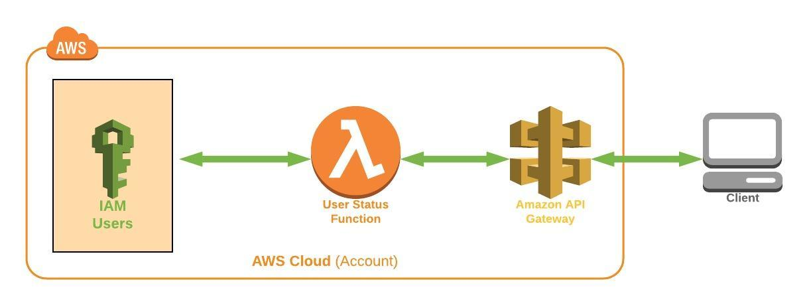

# User Status Lambda




This SAM template is used to deploy a lambda function that allows for the query of metadata related to an IAM User's account, leveraging API gateway and query string parameters.  The template creates a Lambda, API Gateway API, IAM Role, and IAM Policy.

<br />

## Getting Started
---
At a minimum, access to an AWS Account and permissions to deploy all of the resources defined in the template from the CloudFormation console are required.  

If you would like to deploy the template from the commandline, a set of CLI credentials with the permissions to deploy all of the resources defined in the template and the installation and configuration of AWS CLI is required.  For local testing and development of SAM templates and Lambda functions, SAM CLI installation and use is recommended.

<br />

## Prerequisites
---
* Installing AWS CLI: https://docs.aws.amazon.com/cli/latest/userguide/cli-chap-install.html
* Configuring AWS CLI: https://docs.aws.amazon.com/cli/latest/userguide/cli-chap-configure.html
* Installing SAM CLI: https://docs.aws.amazon.com/serverless-application-model/latest/developerguide/serverless-sam-cli-install.html

<br />

## Testing locally
---
Test with api gateway locally:

```
sam local start-api
```

Use curl to query an IAM user account:
```
curl "http://127.0.0.1:3000/?username=jdoe"
```

<br />

## Deploying via AWS CLI

Package the template:
```
aws cloudformation package \
    --template-file template.yaml \
    --s3-bucket sam-artifacts-jane-doe \
    --output-template-file deployment.yaml
```

Deploy the newly packaged template:
```
aws cloudformation deploy \
    --template-file deployment.yaml \
    --stack-name jane-doe-user-status-lambda \
    --tags file://tags.json \
    --region us-west-2 \
    --capabilities CAPABILITY_NAMED_IAM
```

<br />

## Deploying via SAM CLI

Package the template:
```
sam package \
    --template-file template.yaml \
    --s3-bucket sam-artifacts-jane-doe \
    --output-template-file deployment.yaml \ 
```

Deploy the newly packaged template:
```
sam deploy \
    --template-file deployment.yaml \
    --stack-name user-status-lambda-jane-doe \
    --capabilities CAPABILITY_NAMED_IAM \
    --region us-west-2
    --tags file://tags.json
```

<br />

## Package/Deployment Differences
---
### **Resource Tagging**

There is a notable difference in the format of your tags.json file when performing an ``aws cloudformation deploy`` or a ``sam deploy``, versus creating a CloudFormation stack using ``aws cloudformation create-stack`` command.

"*Create*" tags.json file format:
```
[
    "Business_Unit=1Strategy",
    "Owner=Jane Doe",
    "Project=User Status Lambda"
]
```

"*Deploy*" tags.json file format:
```
[
    {
        "Key": "Business_Unit",
        "Value": "1Strategy"
    },
    {
        "Key": "Owner",
        "Value": "Jane Doe"
    },
    {
        "Key": "Project"
        "Value": "User Status Lambda"
    }
]
```

<br />

### **Parameters**

If your template deployment is referencing parameters at the command line, there is a difference on how they are consumed via an ``aws cloudformation deploy`` or ``sam deploy`` command, and an ``aws cloudformation create-stack`` command.

"*create-stack*" params.json file example:
```
[
    {
        "ParameterKey": "KeyPair",
        "ParaemterValue": "MyKey"
    },
    {
        "ParameterKey": "InstanceType",
        "ParameterValue": "t2.micro"
    }
]
```

"*deploy*" params.json example:
```
[
    "KeyPair=MyKey",
    "InstanceType=t2.micro"
]
```


 ## Authors
 ---
* Will Nave - [1Strategy](https://www.1strategy.com)

<br />

## License
---
Copyright 2019 1Strategy

Licensed under the Apache License, Version 2.0 (the "License"); you may not use this file except in compliance with the License. You may obtain a copy of the License at

http://www.apache.org/licenses/LICENSE-2.0

Unless required by applicable law or agreed to in writing, software distributed under the License is distributed on an "AS IS" BASIS, WITHOUT WARRANTIES OR CONDITIONS OF ANY KIND, either express or implied. See the License for the specific language governing permissions and limitations under the License.

<br />

## References
---
* AWS Serverless Application Model Developer's Guide: https://docs.aws.amazon.com/serverless-application-model/latest/developerguide/what-is-sam.html
* SAM CLI: https://github.com/awslabs/aws-sam-cli
* Serverless Application Model Quickstart: https://docs.aws.amazon.com/serverless-application-model/latest/developerguide/serverless-quick-start.html
* SAM Template Basics: https://docs.aws.amazon.com/serverless-application-model/latest/developerguide/serverless-sam-template-basics.html
* SAM Serverless Resources: https://docs.aws.amazon.com/serverless-application-model/latest/developerguide/serverless-sam-template.html
* AWS API Gateway Documentation: https://docs.aws.amazon.com/apigateway/index.html#lang/en_us